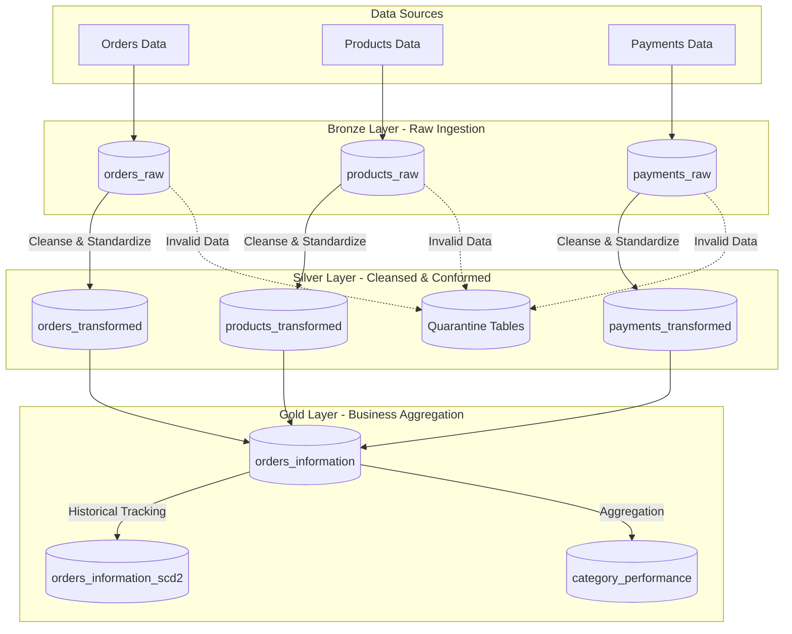

# 🛒 Novacart E-Commerce Data Pipeline

  
  
  
  

## 📖 About the Project

The **Novacart Data Pipeline** is an end-to-end data engineering solution designed to process, clean, and analyze high-velocity e-commerce data. Built on **Azure Databricks**, this project utilizes **PySpark** and **Delta Lake** to ingest raw data (Orders, Products, Payments) and transform it into high-quality, actionable insights using the **Medallion Architecture**.

This project showcases production-ready data engineering concepts including:
- **Lakehouse Federation**: Seamlessly querying and analyzing data across scalable data lakes.
- **Incremental Processing**: Custom watermarking to process only new and changed data, ensuring optimal compute efficiency.
- **Data Quality Control**: Built-in quarantine pipelines to separate corrupted or invalid records without disrupting the main data flow.
- **Slowly Changing Dimensions (SCD Type 2)**: Historical tracking of order and product states, ensuring no loss of historical state for business analytics.

## 🏗️ Architecture

The data pipeline rigorously follows the Medallion Architecture pattern:

### 🥉 Bronze Layer
- **Purpose**: Act as a raw landing zone for ingested data.
- **Process**: Appends unmodified raw records for `orders`, `products`, and `payments` to Delta tables, attaching metadata (`bronze_ingested_at`, `bronze_run_id`) to track pipeline ingestion batches.

### 🥈 Silver Layer
- **Purpose**: Cleanse, validate, and conform the raw data.
- **Process**: 
  - Standardizes timestamps, casts strings to numeric types, and formats text.
  - Implements data quality rules (e.g., ensuring `order_amount` > 0).
  - Routes clean data to `_transformed` tables and sends invalid data to `_quarantine` tables for manual review, ensuring bad data does not halt the pipeline.

### 🥇 Gold Layer
- **Purpose**: Serve business-level aggregations and dimensional modeling for analytics.
- **Process**:
  - Denormalizes data into a cohesive `orders_information` table.
  - Implements **SCD Type 2** via `orders_information_scd2` to track historical changes over time.
  - Aggregates metrics into `category_performance` to track Gross Merchandise Value (GMV), payment completion ratios, and payment failure rates across product categories.

## 🛠️ Technology Stack

- **Compute & Orchestration**: Azure Databricks, Apache Spark
- **Languages**: Python (PySpark), SQL
- **Storage**: Delta Lake, Parquet
- **Architecture**: Medallion Data Lakehouse

## 🚀 How to Run

The repository contains three primary notebooks which should be executed sequentially:

1. `bronze/bronze_work.ipynb`: Ingests initial raw mock data into the Bronze Delta tables.
2. `silver/silver_work.ipynb`: Processes incremental batches from Bronze, cleanses the data, and populates the Silver tables.
3. `gold/gold_work.ipynb`: Joins Silver tables to create the denormalized Gold tables, performs SCD Type 2 merges, and calculates category performance metrics.

## 📬 Contact / Let's Connect

If you'd like to discuss this project, data engineering, or potential opportunities, feel free to reach out!

- **GitHub**: [@ahmedelsheikh109](https://github.com/ahmedelsheikh109)
