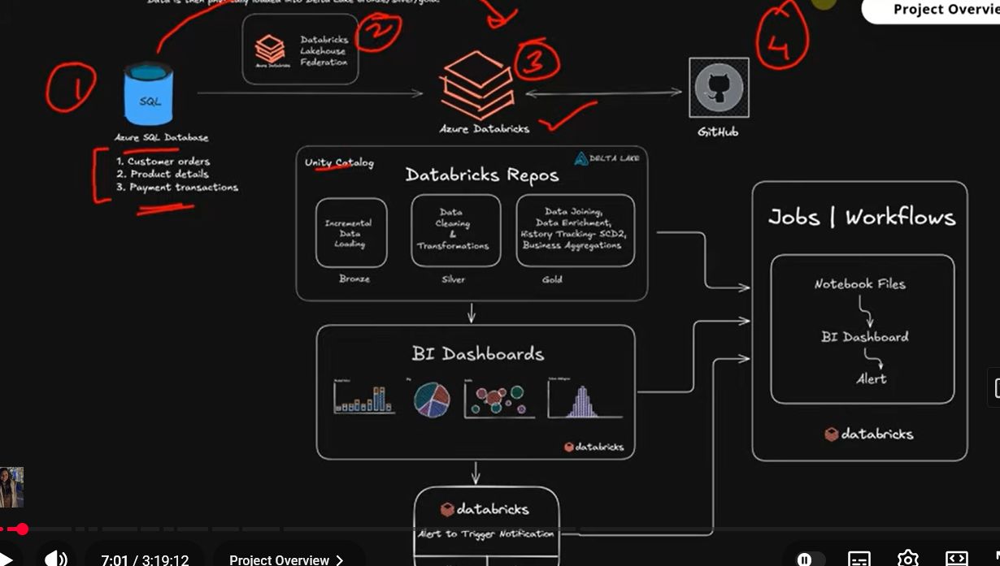

# 🛒 Novacart E-Commerce Data Pipeline

  
  
  
  

## 🏗️ Architecture

  

---

## 🛒 Case Study
We are working with an e-commerce system that generates data across:
- **Products**
- **Orders**
- **Payments**

This data is continuously evolving — new records are inserted and existing records are updated.

**The goal is to design a pipeline that:**
- Processes only new or updated data (processing only what changed, avoiding reprocessing, and keeping the system reliable and scalable)
- Avoids duplicate ingestion
- Maintains state across runs

## 🔌 Ingestion (Lakehouse Federation)
Data is sourced from Azure SQL Database using **Databricks Lakehouse Federation** (Unity Catalog connection).
- Direct access to source tables via Unity Catalog.
- No traditional ETL connectors required.
- Data is incrementally loaded into Delta tables.

## 🧱 Data Model
The pipeline is built on a relational model where:
- Products, orders, and payments are interconnected.
- Changes in one entity can impact downstream outputs.
- Multiple tables are combined to produce analytics-ready data.

## 🔄 Pipeline Design (Medallion Architecture)

### 🥉 Bronze — Raw Layer
- Incremental ingestion using watermark logic.
- Control table to track the last processed state.
- Raw Delta tables with ingestion metadata.

### 🥈 Silver — Clean Layer
- Data cleaning, standardization, and deduplication.
- Data quality checks and quarantine handling.
- Incremental upserts using Delta `MERGE`.

### 🥇 Gold — Business Layer
- Combines data across entities.
- Produces an analytics-ready dataset.
- Maintains historical changes using Slowly Changing Dimensions (**SCD Type 2**).

## 🧑‍💻 Code Management (GitHub + Databricks Repos)
Code is version-controlled using **GitHub**, integrated with Databricks Repos. This setup enables:
- Version control
- Collaboration
- Clean separation of environments

*All pipeline notebooks are managed through this setup.*

## ⚙️ Jobs & Workflows (Orchestration)
The pipeline is orchestrated using **Databricks Jobs / Workflows**, where:
- Notebook files (from Databricks Repos) are executed in sequence.
- Bronze → Silver → Gold layers are chained together.
- BI dashboards are refreshed after pipeline completion.
- Alerts are triggered as part of the workflow.

## 📊 BI Dashboards
The Gold layer powers BI dashboards, enabling:
- Reporting and visualization.
- Consumption of curated business data.
- Insights for downstream users.

## 🔔 Alerts & Monitoring
Alerts are configured to:
- Notify on pipeline failures or issues.
- Trigger based on workflow outcomes.
- Ensure reliability and observability.

## 🔑 Key Concepts Covered
- Incremental loading (no full reloads)
- Watermark logic (timestamp + primary key)
- Delta Lake `MERGE` (upsert)
- Control tables for tracking state
- Idempotent pipeline design
- SCD Type 2
