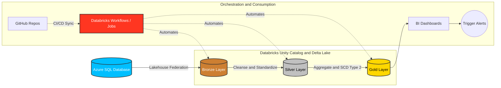

# 🛒 Novacart E-Commerce Data Pipeline

  
  
  
  

## 📖 About the Project

The **Novacart Data Pipeline** is an enterprise-grade data engineering solution built to process, clean, and analyze high-velocity e-commerce data. It ingests transactional data directly from an **Azure SQL Database** using **Databricks Lakehouse Federation**, allowing for seamless and secure data access without moving the underlying data until necessary. 

The core processing engine is built on **Azure Databricks** leveraging **PySpark** and **Delta Lake**. The pipeline rigorously follows the **Medallion Architecture**, progressing data through Bronze, Silver, and Gold layers to ultimately feed **BI Dashboards** and trigger automated **Alerts** based on business metrics. The entire project is integrated with **GitHub** via Databricks Repos for CI/CD and version control, with metadata and governance managed by **Unity Catalog**.

This project showcases production-ready data engineering concepts including:
- **Lakehouse Federation**: Querying external SQL databases directly from Databricks.
- **Medallion Architecture**: Structuring data pipelines into raw, cleansed, and curated layers.
- **Incremental Data Loading**: Efficiently loading only new and changed records to save compute costs.
- **Slowly Changing Dimensions (SCD Type 2)**: Historical tracking of business entity changes over time.
- **Data Quality Control**: Built-in pipelines to quarantine bad records before they pollute downstream analytics.
- **Workflow Automation & Alerting**: Databricks Jobs scheduling notebooks, refreshing dashboards, and triggering notifications.

## 🏗️ Architecture

## ⚙️ Data Pipeline Stages

### 🥉 Bronze Layer
- **Incremental Data Loading**: Acts as the raw landing zone. Data is pulled via Lakehouse Federation from Azure SQL into Delta Lake. Metadata is attached (e.g., ingestion timestamps and run IDs) to track incremental batches.

### 🥈 Silver Layer
- **Data Cleaning & Transformations**: Cleanses and standardizes the raw data. 
  - Standardizes timestamps, casts strings to numeric types, and formats text.
  - Implements data quality rules, quarantining invalid records (like negative payment amounts) for manual review so the main pipeline never breaks.

### 🥇 Gold Layer
- **Business Aggregations & History Tracking**: The curated layer for analytics.
  - Denormalizes data into a cohesive analytical model.
  - Implements **SCD Type 2** to track historical changes (e.g., product price changes or order status updates).
  - Aggregates metrics to track Gross Merchandise Value (GMV), payment completion ratios, and payment failure rates across product categories.

## 📊 Orchestration & Visualization
- **Jobs & Workflows**: Databricks Jobs automate the sequential execution of the Bronze, Silver, and Gold notebooks.
- **BI Dashboards**: The final Gold tables power business intelligence dashboards for stakeholders.
- **Alerts**: Automated alerts are configured to trigger notifications (e.g., via email or Slack) when specific data thresholds are met or if pipeline failures occur.

## 🛠️ Technology Stack

- **Data Sources**: Azure SQL Database
- **Compute & Orchestration**: Azure Databricks, Databricks Workflows, Jobs
- **Governance & Storage**: Unity Catalog, Delta Lake, Parquet
- **Languages**: Python (PySpark), SQL
- **CI/CD & Version Control**: GitHub, Databricks Repos
- **Consumption**: Databricks SQL Dashboards, Alerts

## 📬 Contact / Let's Connect

If you'd like to discuss this project, data engineering, or potential opportunities, feel free to reach out!

- **GitHub**: [@ahmedelsheikh109](https://github.com/ahmedelsheikh109)
